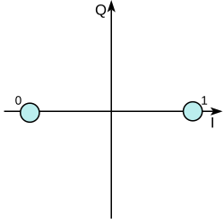
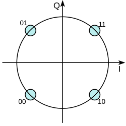
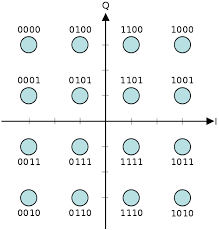

# Отчет: Прототипирование телекоммуникационных систем на ПЛИС

## 📑 Оглавление

- [Тема 1. Двоичное представление чисел](#тема-1-двоичное-представление-чисел-фиксированная-точка)
  - [1.1 Принципы двоичного представления с фиксированной точкой](#11-принципы-двоичного-представления-с-фиксированной-точкой-fixed-point)
  - [1.2 Ошибка квантования и шумы](#12-ошибка-квантования-и-шумы)
  - [1.3 Виды округления](#13-виды-округления)
  - [1.4 Представление отрицательных чисел](#14-представление-отрицательных-чисел-в-двоичной-форме)
- [Тема 2. Виды модуляции сигнала](#тема-2-виды-модуляции-сигнала-qampsk-представление-сигналов-на-комплексной-плоскости)
  - [2.1 Комплексная плоскость как диаграмма сигналов](#21-комплексная-плоскость-как-диаграмма-сигналов-constellation-diagram)
  - [2.2 PSK — фазовая манипуляция](#22-psk--phase-shift-keying-фазовая-манипуляция)
  - [2.3 QAM — квадратурная амплитудная модуляция](#23-qam--quadrature-amplitude-modulation)
  - [2.4 Сравнение модуляций](#24-сравнение-модуляций-по-ключевым-параметрам)
  - [2.5 Влияние шумов](#25-влияние-шумов-и-искажений-на-диаграмму-созвездия)
  - [2.6 EVM — метрика качества](#26-метрика-качества--evm-error-vector-magnitude)

---

## Тема 1. Двоичное представление чисел. Фиксированная точка.

### 1.1 Принципы двоичного представления с фиксированной точкой (Fixed Point)

В системах с фиксированной точкой позиция двоичной запятой (разделителя целой и дробной части) зафиксирована заранее и не меняется в ходе вычислений. Это противоположность плавающей точке, где запятая может "двигаться" в зависимости от порядка числа.

**Формат числа:** Q<sub>I.F</sub> или Qm.n, где:
- I (или m) — количество бит, отведенных под целую часть
- F (или n) — количество бит, отведенных под дробную часть
- Общее количество бит: N = I + F + 1 (если учитывается знаковый бит)

**Веса разрядов (слева направо):**

2<sup>(I-1)</sup>, 2<sup>(I-2)</sup>, ..., 2<sup>1</sup>, 2<sup>0</sup>, 2<sup>(-1)</sup>, 2<sup>(-2)</sup>, ..., 2<sup>(-F)</sup>

**Пример 1 (8-битное число, Q4.4, без знака):**
- Формат: b7 b6 b5 b4 . b3 b2 b1 b0
- Веса: 2<sup>3</sup>, 2<sup>2</sup>, 2<sup>1</sup>, 2<sup>0</sup>, 2<sup>(-1)</sup>, 2<sup>(-2)</sup>, 2<sup>(-3)</sup>, 2<sup>(-4)</sup>
- Двоичная запись: 0110 . 1010
- Вычисление: 0·8 + 1·4 + 1·2 + 0·1 + 1·0.5 + 0·0.25 + 1·0.125 + 0·0.0625 = 4 + 2 + 0.5 + 0.125 = 6.625<sub>10</sub>

**Пример 2 (8-битное число, Q1.7, знаковое, дополнительный код):**
- Формат: s . b6 b5 b4 b3 b2 b1 b0 (s — знаковый бит, вес -2<sup>0</sup>)
- Веса дробной части: 2<sup>(-1)</sup>, 2<sup>(-2)</sup>, ..., 2<sup>(-7)</sup>
- Диапазон: от -1 до +1 - 2<sup>(-7)</sup> ≈ +0.9921875
- Двоичная запись 0.1011000 = 0.5 + 0.125 + 0.0625 = 0.6875
- Двоичная запись 1.1011000 (отрицательное): сначала интерпретируем дробную часть как положительную 0.6875, затем вычитаем из 1 с учетом формата Q1.7 → -1 + 0.6875 = -0.3125

**Шаг квантования (разрешение):**

Δ = 2<sup>(-F)</sup>

Чем больше F, тем мельче шаг, но тем уже диапазон (при фиксированном общем количестве бит).

**Диапазон значений для знакового формата QI.F:**

[-2<sup>I</sup>,  2<sup>I</sup> - 2<sup>(-F)</sup>]

*Вывод:* Увеличение дробной части повышает точность, но уменьшает максимальное представимое число. Увеличение целой части расширяет диапазон, но грубит шаг квантования.

---

### 1.2 Ошибка квантования и шумы

При преобразовании аналогового сигнала в цифровой (АЦП) или при округлении результата вычислений возникает **шум квантования** — разница между реальным значением x и его квантованным представлением Q(x):

e = Q(x) - x

**Причины возникновения:**
1. Аналого-цифровое преобразование — входной сигнал непрерывен, выходной дискретен
2. Округление результатов арифметических операций при ограниченной разрядности
3. Приведение типов в программном обеспечении

**Математическая модель шума квантования (при равномерном квантовании):**

Предполагается, что:
- Ошибка равномерно распределена на интервале [-Δ/2, Δ/2]
- Ошибка не коррелирована с сигналом
- Спектр шума равномерный (белый шум)

**Плотность распределения вероятности:**

p(e) = 1/Δ,  e ∈ [-Δ/2, Δ/2]

**Математическое ожидание ошибки:**

E[e] = 0

**Дисперсия (мощность шума квантования):**

σ<sub>q</sub><sup>2</sup> = ∫ e<sup>2</sup>·(1/Δ) de = Δ<sup>2</sup>/12  [интеграл от -Δ/2 до Δ/2]

**Среднеквадратичное значение (RMS):**

σ<sub>q</sub> = Δ/√12 ≈ 0.2887·Δ

**Отношение сигнал/шум (SNR) для синусоидального сигнала с амплитудой A, оцифрованного с разрядностью N бит (без знака):**

Мощность сигнала: P<sub>s</sub> = A<sup>2</sup>/2

Максимальная амплитуда без клиппинга: A<sub>max</sub> = 2<sup>(N-1)</sup>·Δ (для знакового формата)

P<sub>s,max</sub> = (2<sup>(N-1)</sup>·Δ)<sup>2</sup>/2 = 2<sup>(2N-3)</sup>·Δ<sup>2</sup>

SNR = P<sub>s,max</sub> / σ<sub>q</sub><sup>2</sup> = (2<sup>(2N-3)</sup>·Δ<sup>2</sup>) / (Δ<sup>2</sup>/12) = (3/2)·2<sup>(2N)</sup>

**В децибелах:**

SNR<sub>dB</sub> = 10·log<sub>10</sub>((3/2)·2<sup>(2N)</sup>) = 10·log<sub>10</sub>(1.5) + 20N·log<sub>10</sub>(2) ≈ 1.76 + 6.02N дБ

*Каждый дополнительный бит улучшает SNR примерно на 6 дБ (удвоение отношения сигнал/шум по напряжению).*

**Примеры:**

| Разрядность N | Теоретический SNR (дБ) | Качество |
|---------------|------------------------|----------|
| 8 бит | ~49.9 дБ | Телефонное качество |
| 10 бит | ~62.0 дБ | Радиовещание AM |
| 12 бит | ~74.0 дБ | CD-качество |
| 16 бит | ~98.1 дБ | Audio CD (стандарт) |
| 20 бит | ~121.2 дБ | Профессиональный звук |
| 24 бит | ~145.2 дБ | Предел физической электроники |

**Важное замечание:** Приведенная формула — теоретический предел для равномерного квантования с оптимальным уровнем сигнала. Реальный SNR всегда ниже из-за неидеальности АЦП.

---

### 1.3 Виды округления

При переходе от реального числа к дискретному представлению используются разные стратегии.

**Обозначения:**
- x — реальное число
- Δ — шаг квантования
- Q(x) — квантованное значение
- ⌊x⌋ — целая часть (пол вниз)
- ⌈x⌉ — целая часть (потолок вверх)

#### 1.3.1 Округление к ближайшему (Round to Nearest, Round-Half-Up)

Самый распространенный метод. Значение округляется до ближайшего дискретного уровня.

Q(x) = Δ·⌊x/Δ + 0.5⌋

**Ошибка:** e ∈ [-Δ/2, Δ/2], равномерное распределение.

#### 1.3.2 Округление к ближайшему четному (Round-Half-Even, Banker's Rounding)

Специальный метод для случая, когда дробная часть равна ровно 0.5. В этом случае округление происходит к ближайшему четному целому. 
- 2.5 → 2
- 3.5 → 4
- 4.5 → 4
- 5.5 → 6

**Преимущество:** Устраняет систематическое смещение при многократных вычислениях.

#### 1.3.3 Усечение (Truncation, Round toward Zero)

Отбрасывание дробной части.

Q(x) = Δ·⌊x/Δ⌋

**Ошибка:** для положительных x ошибка ∈ [0, Δ), для отрицательных x ошибка ∈ (-Δ, 0].

#### 1.3.4 Округление с избытком (Round toward +∞, Ceil)

Q(x) = Δ·⌈x/Δ⌉

Всегда округление вверх. Ошибка e ∈ [0, Δ) для всех x.

#### 1.3.5 Округление к нулю (Round toward 0)

Q(x) = Δ·sign(x)·⌊|x|/Δ⌋

Симметричное усечение относительно нуля. Ошибка по модулю ∈ [0, Δ).

**Сравнительная таблица характеристик:**

| Тип округления | Диапазон ошибки | Мат. ожидание ошибки | Применение |
| :--- | :--- | :--- | :--- |
| К ближайшему (Half-Up) | [-Δ/2, Δ/2] | 0 | Стандарт IEEE 754 |
| К ближайшему четному | [-Δ/2, Δ/2] | 0 | Финансы, БПФ |
| Усечение (к нулю) | [0, Δ) для x≥0; (-Δ, 0] для x<0 | ≈ -Δ/2 | Цифровые фильтры |
| С избытком (Ceil) | [0, Δ) | +Δ/2 | Специальные алгоритмы |
| К нулю (симметричное) | (-Δ, Δ) | 0 | DSP-процессоры |

---

### 1.4 Представление отрицательных чисел в двоичной форме

Существует три классических способа представления целых чисел со знаком.

#### 1.4.1 Прямой код (Sign-Magnitude)

Формат: старший бит — знак (0 для плюса, 1 для минуса), остальные — модуль числа.
- +5<sub>10</sub> = 0101
- -5<sub>10</sub> = 1101

**Диапазон для N-бит:** [-(2<sup>(N-1)</sup>-1), +(2<sup>(N-1)</sup>-1)]

**Недостатки:**
- Два представления нуля: 0000 (+0) и 1000 (-0)
- Сложная арифметика

#### 1.4.2 Обратный код (Ones' Complement)

Отрицательное число получается инверсией всех битов положительного числа.
- +5<sub>10</sub> = 0101
- -5<sub>10</sub> = 1010

**Диапазон для N-бит:** [-(2<sup>(N-1)</sup>-1), +(2<sup>(N-1)</sup>-1)]

**Особенности:**
- Также два нуля: 0000 (+0) и 1111 (-0)
- Арифметика требует end-around carry

#### 1.4.3 Дополнительный код (Two's Complement) — Стандарт де-факто

**Определение:** Отрицательное число -x в N-битном представлении получается как 2<sup>N</sup> - x, что эквивалентно инверсии всех битов с последующим прибавлением 1.

-x = ~x + 1

**Пример (4 бита):**

Представим -5:
1. Записываем +5 = 0101
2. Инвертируем биты: 1010
3. Прибавляем 1: 1011

Проверка: 1011<sub>2</sub> = -8 + 2 + 1 = -5<sub>10</sub>

**Диапазон значений для N-бит:** [-2<sup>(N-1)</sup>, +2<sup>(N-1)</sup>-1]

**Пример для N=4 (значения от -8 до +7):**

| Десятичное | Двоичное (доп. код) |
|------------|---------------------|
| +7 | 0111 |
| +6 | 0110 |
| +5 | 0101 |
| +4 | 0100 |
| +3 | 0011 |
| +2 | 0010 |
| +1 | 0001 |
| 0 | 0000 |
| -1 | 1111 |
| -2 | 1110 |
| -3 | 1101 |
| -4 | 1100 |
| -5 | 1011 |
| -6 | 1010 |
| -7 | 1001 |
| -8 | 1000 |

**Ключевые свойства дополнительного кода:**

1. **Один ноль:** Все биты нулевые. Представления -0 не существует.

2. **Асимметрия диапазона:** Отрицательных чисел на одно больше, чем положительных.

3. **Простота сложения:** Сложение выполняется как с беззнаковыми числами, перенос игнорируется.

4. **Расширение знака:** Знаковый бит копируется во все добавляемые старшие биты.

5. **Инверсия знака:** Достаточно инверсии и прибавления единицы.

**Сравнение трех методов для N=4:**

| Дес. | Прямой код | Обратный код | Доп. код |
|------|------------|--------------|----------|
| +5   | 0101       | 0101         | 0101     |
| -5   | 1101       | 1010         | 1011     |
| +0   | 0000       | 0000         | 0000     |
| -0   | 1000       | 1111         | —        |

**Почему дополнительный код стал стандартом:** Единое представление нуля, единый алгоритм сложения, простота аппаратной реализации.

---

## Тема 2. Виды модуляции сигнала (QAM, PSK), представление сигналов на комплексной плоскости

### 2.1 Комплексная плоскость как диаграмма сигналов (Constellation Diagram)

#### 2.1.1 Почему комплексная плоскость?

Любой радиосигнал можно описать как синусоидальную несущую, у которой меняются амплитуда и фаза. Классическая форма записи:

S(t) = A(t)·cos(ω<sub>c</sub>·t + φ(t))

где A(t) — амплитуда, φ(t) — фаза, ω<sub>c</sub> — несущая частота.

Переход к комплексной огибающей:

S(t) = Re{ (I(t) + j·Q(t))·e<sup>(j·ω<sub>c</sub>·t)</sup> } = I(t)·cos(ω<sub>c</sub>·t) - Q(t)·sin(ω<sub>c</sub>·t)

**Компоненты:**
- I(t) (In-phase) — синфазная компонента
- Q(t) (Quadrature) — квадратурная компонента

**Переход к полярным координатам:**

A = √(I<sup>2</sup> + Q<sup>2</sup>),  φ = arctan(Q/I)

**Преимущества комплексного представления:**
- Любая точка задает уникальную пару (амплитуда, фаза)
- Сложение сигналов соответствует сложению комплексных чисел
- Умножение на e<sup>(jφ)</sup> соответствует повороту фазы

#### 2.1.2 Диаграмма созвездия (Constellation Diagram)

**Определение:** Набор точек на комплексной плоскости, каждая из которых соответствует одному символу (кодовой комбинации битов). Расстояние между точками определяет помехоустойчивость.

**Стандартные обозначения:**
- Горизонтальная ось — I (синфазная компонента)
- Вертикальная ось — Q (квадратурная компонента)

---

### 2.2 PSK — Phase Shift Keying (Фазовая манипуляция)

При PSK информация кодируется **фазой** сигнала. Амплитуда остается постоянной.

#### 2.2.1 BPSK (Binary Phase Shift Keying, 2-PSK)

**Используемые фазы:** 0° и 180°.
- Бит 0: +1 (I=1, Q=0)
- Бит 1: -1 (I=-1, Q=0)


*Рисунок 1: Диаграмма созвездия BPSK*

Расстояние между двумя точками: 2.

**Скорость передачи:** 1 бит на символ.

**Формула сигнала:**

S<sub>BPSK</sub>(t) = A·m(t)·cos(ω<sub>c</sub>·t), где m(t) = +1 или -1.

**Достоинства:** максимальная помехоустойчивость. **Недостатки:** низкая спектральная эффективность.

**Применение:** GPS, спутниковая связь, RFID.

#### 2.2.2 QPSK (Quadrature Phase Shift Keying, 4-PSK)

**Используемые фазы:** 45°, 135°, 225°, 315°.

**Стандартное отображение битов (Gray coding):**
- 00 → фаза 45°: I = +1/√2, Q = +1/√2
- 01 → фаза 135°: I = -1/√2, Q = +1/√2
- 11 → фаза 225°: I = -1/√2, Q = -1/√2
- 10 → фаза 315°: I = +1/√2, Q = -1/√2


*Рисунок 2: Диаграмма созвездия QPSK*

**Скорость передачи:** 2 бита на символ.

**Применение:** Спутниковая связь (DVB-S), сотовые сети, Wi-Fi.

#### 2.2.3 8-PSK

**Используемые фазы:** 0°, 45°, 90°, 135°, 180°, 225°, 270°, 315°.

**Скорость передачи:** 3 бита на символ.

**Применение:** EDGE, некоторые спутниковые стандарты.

#### 2.2.4 π/4-QPSK

Особенность: каждый следующий символ повернут на 45° относительно предыдущего. Исключает прохождение сигнала через ноль.

---

### 2.3 QAM — Quadrature Amplitude Modulation

При QAM информация кодируется **одновременно и амплитудой, и фазой**.

#### 2.3.1 Общий принцип

**Формула символа:** C = I + j·Q = A·e<sup>(j·φ)</sup>

#### 2.3.2 QAM-16

**Сетка:** 4×4 = 16 точек.
**Координаты:** I, Q ∈ {-3, -1, +1, +3}.


*Рисунок 3: Диаграмма созвездия QAM-16*

**Скорость передачи:** 4 бита на символ.

**Применение:** Wi-Fi (802.11a/g), DVB-T, ADSL.

#### 2.3.3 QAM-64

**Сетка:** 8×8 = 64 точки.
**Координаты:** I, Q ∈ {-7, -5, -3, -1, +1, +3, +5, +7}.

**Скорость передачи:** 6 бит на символ.

**Применение:** DVB-T2, DVB-C, 4G/LTE, Wi-Fi 802.11ac.

#### 2.3.4 QAM-256 и выше

**QAM-256:** 16×16 = 256 точек, 8 бит/символ. Применение: DOCSIS 3.1, 5G, Wi-Fi 6.

**QAM-1024:** 32×32 = 1024 точки, 10 бит/символ. Применение: Ethernet 10GBASE-T.

**QAM-4096:** 64×64 = 4096 точек, 12 бит/символ. Для очень коротких расстояний.

---

### 2.4 Сравнение модуляций по ключевым параметрам

| Параметр | BPSK | QPSK | 8-PSK | 16-QAM | 64-QAM | 256-QAM |
|----------|------|------|-------|--------|--------|---------|
| **Бит на символ** | 1 | 2 | 3 | 4 | 6 | 8 |
| **Точек в созвездии** | 2 | 4 | 8 | 16 | 64 | 256 |
| **Мин. расстояние (d_min)** | 2.0 | 1.414 | 0.765 | ~0.632 | ~0.308 | ~0.154 |
| **Требуемый Eb/N0** | ~9.5 дБ | ~9.5 дБ | ~13.5 дБ | ~14.5 дБ | ~18.5 дБ | ~23.5 дБ |
| **Пик-фактор (PAPR)** | 0 дБ | 0 дБ | 0 дБ | ~2-3 дБ | ~4-6 дБ | ~6-8 дБ |
| **Спектр. эффективность** | 1 | 2 | 3 | 4 | 6 | 8 |

---

### 2.5 Влияние шумов и искажений на диаграмму созвездия

#### 2.5.1 Аддитивный белый гауссовский шум (AWGN)

Каждая точка созвездия "размывается" в облако с гауссовским распределением.

#### 2.5.2 Фазовый шум (Phase Noise)

Вращение всего созвездия на случайный угол. Точки превращаются в дуги окружности.

#### 2.5.3 Нелинейные искажения

Точки на краях созвездия "сжимаются" по амплитуде. Особенно критично для QAM высокой порядковости.

---

### 2.6 Метрика качества — EVM (Error Vector Magnitude)

**Определение:** EVM — мера отклонения принятых символов от идеальных позиций.

**Формула:**

EVM = [ √( (1/N)·Σ|E<sub>k</sub>|<sup>2</sup> ) / P<sub>ref</sub> ] · 100%

где:
- E<sub>k</sub> — вектор ошибки для k-го символа
- P<sub>ref</sub> — средняя мощность идеального созвездия

**Связь с SNR:**

SNR ≈ 1 / EVM<sup>2</sup> (в линейных единицах)

**Типичные значения:**

| Модуляция | Хороший EVM | Предельный EVM |
|-----------|-------------|----------------|
| BPSK | < 15% | ~30% |
| QPSK | < 10% | ~25% |
| 16-QAM | < 5% | ~12% |
| 64-QAM | < 3% | ~8% |
| 256-QAM | < 2% | ~5% |

---

### 2.7 Итоговая таблица применения по стандартам

| Стандарт/Система | Модуляции | Примечание |
|------------------|-----------|-------------|
| GPS L1 C/A | BPSK | Спектр расширен PRN-кодом |
| DVB-S (спутник) | QPSK, 8-PSK | Сверточное кодирование |
| DVB-T (эфир) | QPSK, 16-QAM, 64-QAM | Адаптивный выбор |
| DVB-C (кабель) | 16-QAM ... 256-QAM | Высокий SNR |
| Wi-Fi 802.11a/g | BPSK, QPSK, 16-QAM, 64-QAM | Адаптивная модуляция |
| Wi-Fi 802.11ac/ax | + 256-QAM, 1024-QAM | MIMO-каналы |
| 4G/LTE | QPSK, 16-QAM, 64-QAM | AMC (адаптация) |
| 5G NR | + 256-QAM | До 1024 точек |
| ADSL/ADSL2 | 4-QAM ... 32768-QAM | DMT модуляция |
| Ethernet 10GBASE-T | PAM-16 | Не классическая QAM |
```
